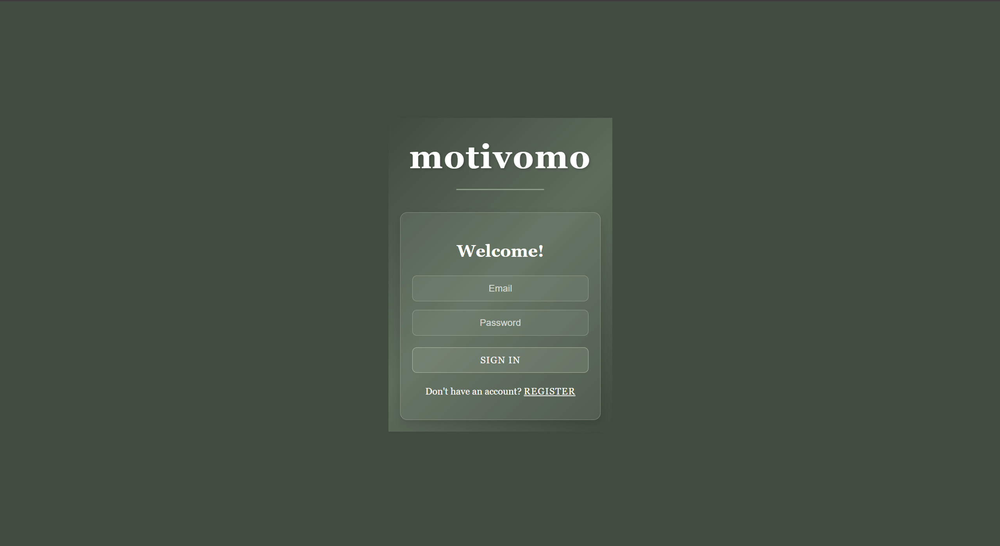
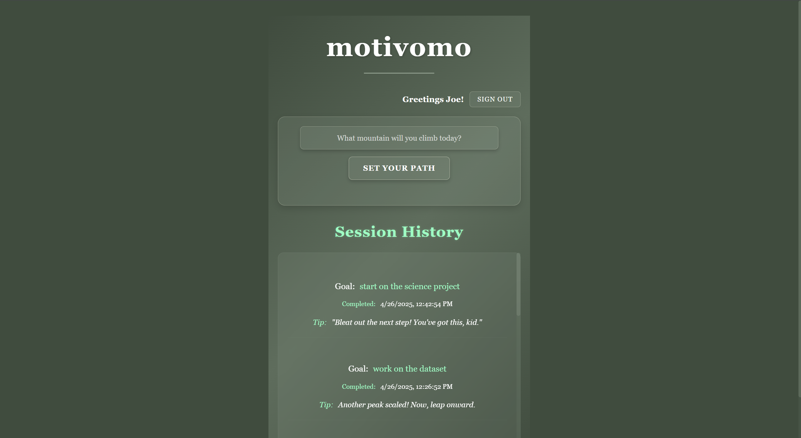
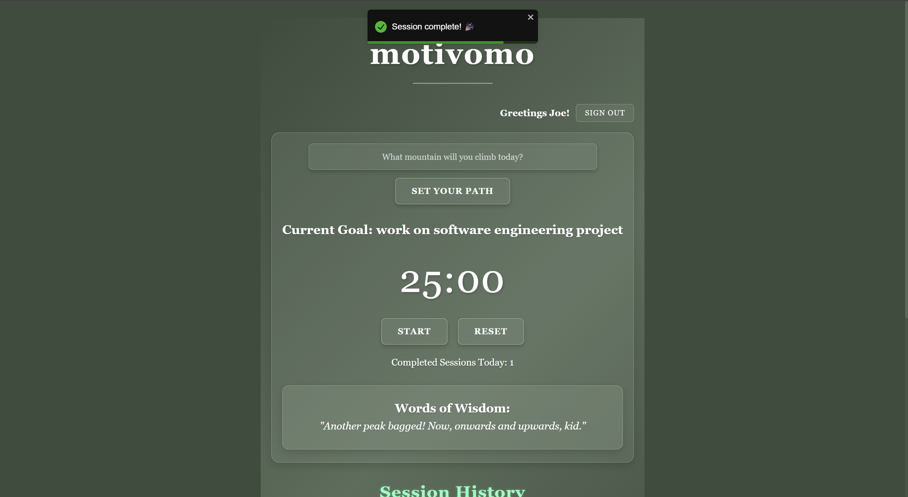

# 📱 Motivomo

**Motivomo** is a productivity-focused web app that helps users stay motivated and on track using structured Pomodoro work sessions, enhanced with AI-powered motivational tips.

⏱️ Stay focused, 🎯 crush your goals, and 🧠 get inspired after every session!

*This is an early prototype built for learning and experimentation.*

---

## 🚀 Live Demo
🌐 [Check out Motivomo here](https://motivomo-2c693.web.app/)

---

## ✨ Features
- ⏱️ 25-minute Pomodoro focus sessions with start, pause, and reset controls
- ✅ Set your focus goal or task for the day (e.g., "Study for CS exam")
- 🧠 Receive AI-generated motivational or productivity tips after each session
- 🎯 Track completed sessions and view daily focus progress

---

## 📂 Tech Stack
- **Frontend:** React (Vite)
- **Hosting:** Firebase Hosting
- **Database:** Firebase Firestore (for session and goal tracking)
- **Deployment:** GitHub Actions (automatic deployment on PR merges)

---

## 📸 Screenshots

### Login Page

### Main Page & Session History

### New Goal

### AI-Powered Motivational Tip (in the words of a wise goat!)
